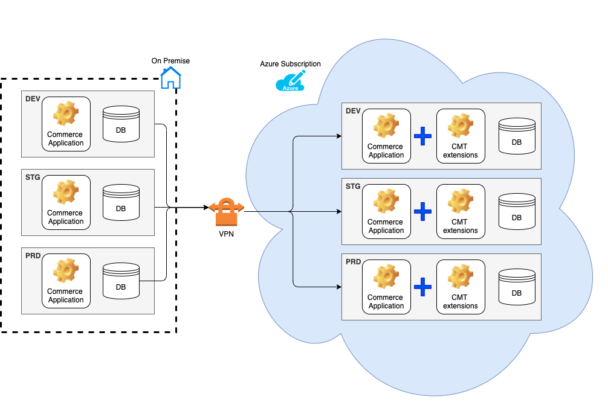

# Commerce Migration Toolkit

The Commerce Migration Toolkit is a `self-service tool` that allows `SAP Customers / Partners` to migrate a `SAP Commerce on-premise installation to SAP Commerce Cloud (ccv2)`.

The implementation of this tool is based on regular SAP Commerce extensions. Adding the extensions to your code base in the cloud subscription will provide you with the functionality to migrate the source database, and, paired with the self-service media process described on [this CXWorks article](https://www.sap.com/cxworks/article/508629017/migrate_to_sap_commerce_cloud_migrate_media_with_azcopy) allows to self-service the migration of an on-premise customer environment to their cloud subscription.

# Getting started

* [Prerequisites](commercemigration/resources/doc/prerequisites/PREREQUISITES-GUIDE.md) Carefully read the prerequisites and make sure you meet the requirements before you start the migration. Some of the prerequisites may require code adaptations or database cleanup tasks to prepare for the migration. Therefore, ensure you reserve sufficient time so that you can adhere to your project plan.
* [Security Guide](commercemigration/resources/doc/security/SECURITY-GUIDE.md) A data migration typically features sensitive data and uses delicate system access. Make sure you have read the Security Guide before you proceed with any migration activities and thereby acknowledge the security recommendations stated in the guide.
* [User Guide](commercemigration/resources/doc/user/USER-GUIDE.md) When ready to start the migration activities, follow the instructions in the User Guide to trigger the data migration.
* [Performance Guide](commercemigration/resources/doc/performance/PERFORMANCE-GUIDE.md) Performance is crucial for any data migration, not only for large databases but also generally to reduce the time of the cut-over window. The performance guide explains the basic concept of performance tuning and also provides benchmarks that will give you an impression of how to estimate the cutover time window.
* [Configuration Guide](commercemigration/resources/doc/configuration/CONFIGURATION-GUIDE.md) The extensions ship with a default configuration that may need to be adjusted depending on the desired behaviour. This guide explains how different features and behaviours can be configured.
* [Developer Guide](commercemigration/resources/doc/developer/DEVELOPER-GUIDE.md) If you want to contribute please read this guide.
* [Troubleshooting Guide](commercemigration/resources/doc/troubleshooting/TROUBLESHOOTING-GUIDE.md) A collection of common problems and how to tackle them.

# System Landscape

# Features Overview

* Database Connectivity
  * Supported source databases: Oracle, MySQL, HANA, MSSQL
  * UI based connection validation
* Schema Differences
  * UI based schema differences detector
  * Automated target schema adaption
    * Table creation / removal
    * Column creation / removal
  * Configurable behaviour
* Data Copy
  * UI based copy trigger
  * Configurable target table truncation
  * Configurable index disabling
  * Read/write batching with configurable sizes
  * Copy parallelization
  * Cluster awareness
  * Column exclusions
  * Table exclusions/inclusions
  * Incremental mode (delta)
  * Custom tables
  * Staged approach using table prefix
* Reporting / Audit
  * Automated reporting for schema changes
  * Automated reporting for copy processes
  * Stored on blob storage
  * Logging of all actions triggered from the UI

# Compatibility

  * SAP Commerce (>=1811)
  * Tested with source databases:
    * MSSQL (2019)
    * MySQL (5.7)
    * Oracle (XE 11g)
    * HANA (express 2.0)
  * Target database (MSSQL)

# Limitations

  * Database Features
    * The tool only copies over table data. Any other database features like 'views', stored procedures', 'synonyms' ... will be ignored.
    * Only the database vendors mentioned in the Compatibility section are supported
    * The target database must always be MSSQL (SQL Server)

# Demo Video

  https://sapvideoa35699dc5.hana.ondemand.com/?entry_id=1_gxduwrl3

# Get the Code and Upgradability

For instructions on how to get this code please refer to the official GitHub documentation:

https://docs.github.com/en/github/getting-started-with-github/using-github

Typical steps:

1. Clone or download the repository
2. Move the extensions to your commerce installation (if not already there)
3. Commit the extensions to your own git repository
4. To upgrade to a new version repeat the steps above.

The detailed installation and configuration steps can be found in the [User Guide](commercemigration/resources/doc/user/USER-GUIDE.md)

Since the code is under your control then, this allows you to make changes to the extensions if needed.

Alternative:

Use git submodule and point to this repository. For more information refer to:

https://git-scm.com/docs/git-submodule

SAP Commerce Cloud supports git submodule and allows you to fetch the repository upon build time, so there is no need to copy the extensions to your own repository.
To upgrade make sure your submodule points to the desired release / commit

# How to Obtain Support

This repository is provided "as-is"; no support is available.

Find more information about SAP Commerce Cloud Setup on our [help site](https://help.sap.com/viewer/product/SAP_COMMERCE_CLOUD_PUBLIC_CLOUD/LATEST/en-US).

# License
Copyright (c) 2021 SAP SE or an SAP affiliate company. All rights reserved. This project is licensed under the Apache Software License, version 2.0 except as noted otherwise in the [LICENSE file](LICENSES/Apache-2.0.txt).

